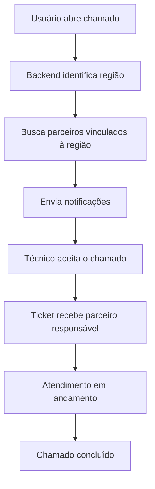
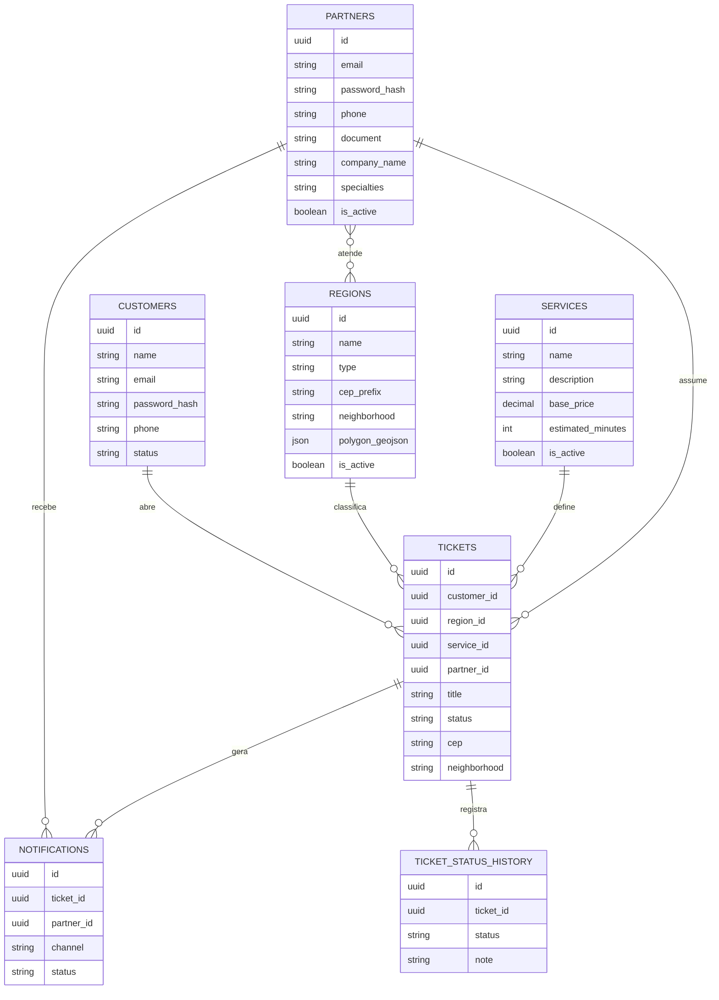

# Diagramas Do Fluxo

## Fluxo Principal Do Chamado

```mermaid
flowchart TD
  A[Usuário abre chamado] --> B[Backend identifica região]
  B --> C[Busca parceiros vinculados à região]
  C --> D[Envia notificações]
  D --> E[Técnico aceita o chamado]
  E --> F[Ticket recebe parceiro responsável]
  F --> G[Atendimento em andamento]
  G --> H[Chamado concluído]
```

## Entidades Do Banco

```mermaid
erDiagram
  CUSTOMERS ||--o{ TICKETS : abre
  PARTNERS ||--o{ NOTIFICATIONS : recebe
  PARTNERS }o--o{ REGIONS : atende
  REGIONS ||--o{ TICKETS : classifica
  SERVICES ||--o{ TICKETS : define
  TICKETS ||--o{ TICKET_STATUS_HISTORY : registra
  TICKETS ||--o{ NOTIFICATIONS : gera
  PARTNERS ||--o{ TICKETS : assume

  CUSTOMERS {
    uuid id
    string name
    string email
    string password_hash
    string phone
    string status
  }

  PARTNERS {
    uuid id
    string email
    string password_hash
    string phone
    string document
    string company_name
    string specialties
    boolean is_active
  }

  REGIONS {
    uuid id
    string name
    string type
    string cep_prefix
    string neighborhood
    json polygon_geojson
    boolean is_active
  }

  SERVICES {
    uuid id
    string name
    string description
    decimal base_price
    int estimated_minutes
    boolean is_active
  }

  TICKETS {
    uuid id
    uuid customer_id
    uuid region_id
    uuid service_id
    uuid partner_id
    string title
    string status
    string cep
    string neighborhood
  }

  TICKET_STATUS_HISTORY {
    uuid id
    uuid ticket_id
    string status
    string note
  }

  NOTIFICATIONS {
    uuid id
    uuid ticket_id
    uuid partner_id
    string channel
    string status
  }
```

