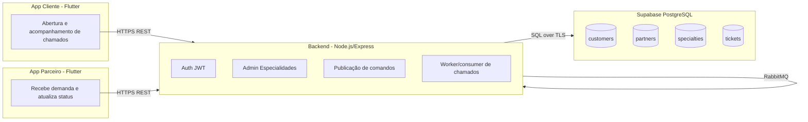
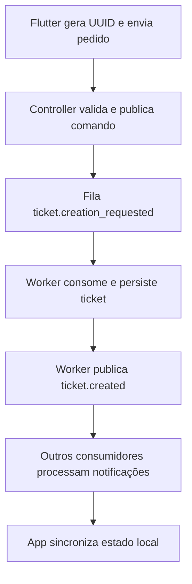
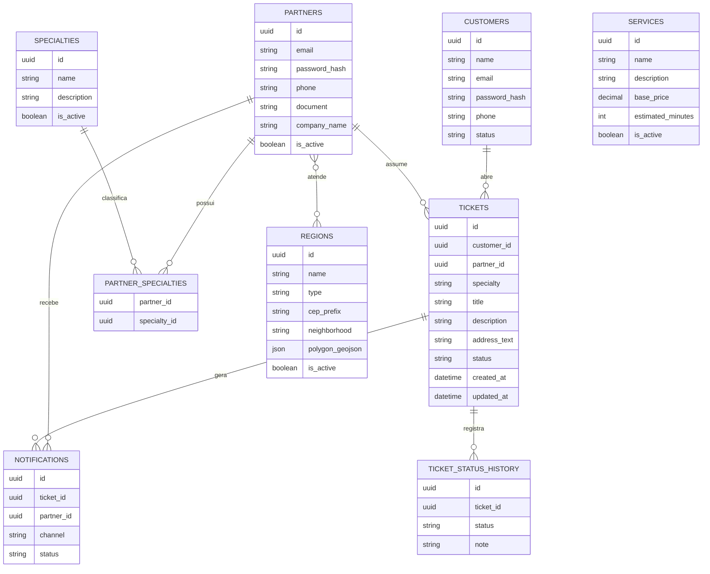

# Diagramas Do Fluxo

## Arquitetura Atual

```mermaid
flowchart LR
  subgraph Cliente[App Cliente - Flutter]
    C1[Abertura e acompanhamento de chamados]
  end

  subgraph Parceiro[App Parceiro - Flutter]
    P1[Recebe demanda e atualiza status]
  end

  subgraph API[Backend - Node.js/Express]
    A1[Auth JWT]
    A2[Admin Especialidades]
    A3[Publicação de comandos]
    A4[Worker/consumer de chamados]
  end

  subgraph DB[Supabase PostgreSQL]
    D1[(customers)]
    D2[(partners)]
    D3[(specialties)]
    D4[(tickets)]
  end

  C1 -->|HTTPS REST| API
  P1 -->|HTTPS REST| API
  API -->|SQL over TLS| DB
  API -->|RabbitMQ| API
```

## Fluxo Principal Do Chamado

```mermaid
flowchart TD
  A[Flutter gera UUID e envia pedido] --> B[Controller valida e publica comando]
  B --> C[Fila ticket.creation_requested]
  C --> D[Worker consome e persiste ticket]
  D --> E[Worker publica ticket.created]
  E --> F[Outros consumidores processam notificações]
  F --> G[App sincroniza estado local]
```

## Entidades Do Banco

```mermaid
erDiagram
  CUSTOMERS ||--o{ TICKETS : abre
  PARTNERS ||--o{ NOTIFICATIONS : recebe
  PARTNERS ||--o{ PARTNER_SPECIALTIES : possui
  SPECIALTIES ||--o{ PARTNER_SPECIALTIES : classifica
  PARTNERS }o--o{ REGIONS : atende
  TICKETS ||--o{ TICKET_STATUS_HISTORY : registra
  TICKETS ||--o{ NOTIFICATIONS : gera
  PARTNERS ||--o{ TICKETS : assume

  CUSTOMERS {
    uuid id
    string name
    string email
    string password_hash
    string phone
    string status
  }

  PARTNERS {
    uuid id
    string email
    string password_hash
    string phone
    string document
    string company_name
    boolean is_active
  }

  SPECIALTIES {
    uuid id
    string name
    string description
    boolean is_active
  }

  PARTNER_SPECIALTIES {
    uuid partner_id
    uuid specialty_id
  }

  REGIONS {
    uuid id
    string name
    string type
    string cep_prefix
    string neighborhood
    json polygon_geojson
    boolean is_active
  }

  SERVICES {
    uuid id
    string name
    string description
    decimal base_price
    int estimated_minutes
    boolean is_active
  }

  TICKETS {
    uuid id
    uuid customer_id
    uuid partner_id
    string specialty
    string title
    string description
    string address_text
    string status
    datetime created_at
    datetime updated_at
  }

  TICKET_STATUS_HISTORY {
    uuid id
    uuid ticket_id
    string status
    string note
  }

  NOTIFICATIONS {
    uuid id
    uuid ticket_id
    uuid partner_id
    string channel
    string status
  }
```

